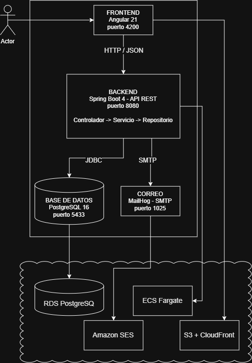

# Sistema de Préstamo de Equipos

Plataforma interna para solicitar el préstamo temporal de equipos tecnológicos.
El sistema impide que un mismo equipo sea reservado por dos personas en fechas
que se solapen, y envía un correo de confirmación al crear la reserva.

## Stack

| Componente | Tecnología |
|---|---|
| Backend | Java 25 + Spring Boot 4.1 (JdbcTemplate, SQL explícito) |
| Base de datos | PostgreSQL 16 |
| Frontend | Angular 21 |
| Correo | MailHog (SMTP de pruebas) |
| Pruebas | JUnit 5 |
| Infraestructura local | Docker Compose |

## Arquitectura



## Cómo levantarlo

**Requisitos:** Docker Desktop, JDK 25 y Node.js 20 o superior.

### 1. Base de datos y correo

Desde la raíz del proyecto:

```bash
docker compose up -d
```

Levanta PostgreSQL en el puerto `5433` y MailHog en el `1025` (bandeja web en
`http://localhost:8025`). La primera vez ejecuta automáticamente
`db/01-schema.sql` y `db/02-seed.sql`.

> Se usa el puerto 5433 en lugar del 5432 para no chocar con instalaciones
> nativas de PostgreSQL.

Para reiniciar la base desde cero: `docker compose down -v`

### 2. Backend

```bash
cd backend
```

```bash
.\mvnw.cmd spring-boot:run
```

En Linux o macOS: `./mvnw spring-boot:run`. Queda en `http://localhost:8080`.

### 3. Frontend

En otra terminal:

```bash
cd frontend
```

```bash
npm install
```

```bash
npm start
```

Aplicación en **`http://localhost:4200`**.

## API

| Método | Ruta | Qué hace |
|---|---|---|
| `GET` | `/api/equipos` | Catálogo con el estado de cada equipo |
| `GET` | `/api/usuarios` | Usuarios de prueba |
| `POST` | `/api/reservas` | Crea una reserva (`201`) |
| `GET` | `/api/reservas?usuarioId=1` | Histórico del usuario |
| `PATCH` | `/api/reservas/{id}/devolver` | Marca la reserva como devuelta (`204`) |

Errores: `400` datos inválidos · `404` no existe · `409` fechas solapadas o
equipo en mantenimiento. Todos con el mismo formato:

```json
{ "estado": 409, "mensaje": "El equipo ya esta reservado del 2026-09-10 al 2026-09-15" }
```

## Manejo de la concurrencia

El riesgo es una condición de carrera: entre comprobar que un equipo está libre
e insertar la reserva hay una ventana en la que otra petición puede colarse. Se
resuelve con dos capas.

**Capa 1 — bloqueo pesimista.** `ReservaService.crear()` es `@Transactional` y
lee el equipo con `SELECT ... FOR UPDATE`. Esa fila queda bloqueada hasta el
`COMMIT`, así que una segunda petición sobre el mismo equipo espera su turno en
lugar de avanzar en paralelo. Cuando entra, ya ve la reserva recién creada y
responde `409` indicando qué fechas están ocupadas.

**Capa 2 — restricción en la base de datos.**

```sql
CONSTRAINT sin_solapamiento EXCLUDE USING gist (
  equipo_id WITH =,
  daterange(fecha_inicio, fecha_fin, '[]') WITH &&
) WHERE (estado <> 'DEVUELTA')
```

PostgreSQL impide físicamente guardar dos reservas del mismo equipo con fechas
que se toquen, aunque la lógica de la aplicación fallara o hubiera varias
instancias del backend. Detalles:

- `'[]'` — rango cerrado: el día de devolución cuenta como ocupado
- `&&` — operador de solapamiento; cubre todos los casos de una vez
- `WHERE estado <> 'DEVUELTA'` — devolver un equipo libera sus fechas
- Requiere la extensión `btree_gist`

**Por qué las dos:** la base garantiza la integridad; la aplicación permite dar
un mensaje explicativo en lugar de un error genérico.

Se descartó el bloqueo optimista con columna de versión: rinde mejor cuando las
colisiones son raras, pero aquí la colisión es justo el caso a proteger.

## Pruebas

```bash
cd backend
```

```bash
.\mvnw.cmd test
```

La regla vive aislada en `Solapamiento.seSolapan()`, una función pura
sin dependencias, y es la misma que usa el servicio.

## Seguridad

- Sin credenciales en el repositorio: la configuración usa
  `${VARIABLE:valor_por_defecto}`, de modo que en producción se inyectan
  variables de entorno y los valores por defecto son de desarrollo local
- Consultas parametrizadas en todos los repositorios
- CORS restringido a `http://localhost:4200`
- Validación de entrada con Bean Validation antes de la lógica de negocio
- Datos ficticios en el seed
